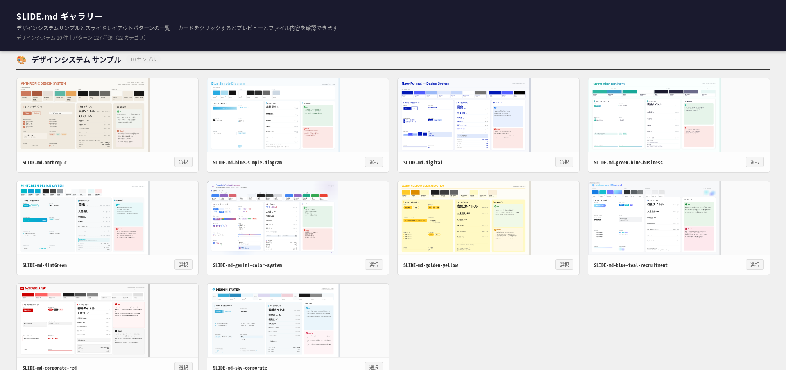
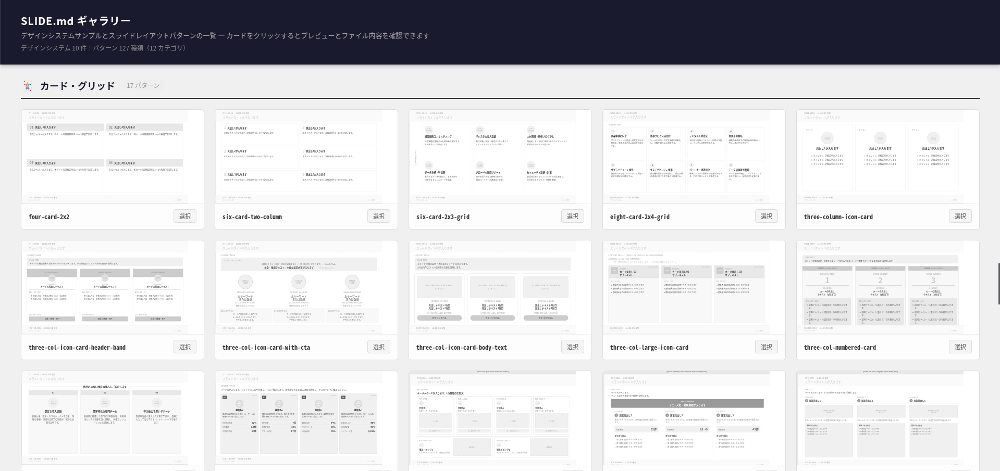

# SLIDE.md

**AIとスライドを作るための設計書フォーマットと、それを生成するClaude Codeスキルパッケージ。**


**→ <a href="https://sho-ai-magic.github.io/slide.md/lp.html" target="_blank">ランディングページを見る</a>**

[Google DESIGN.md](https://stitch.withgoogle.com/docs/design-md/overview) のコンセプトに着想を得た、スライドに特化した設計書フォーマット「SLIDE.md」の仕様と、それを自動生成するClaude Codeスキルを公開しています。

---

## SLIDE.md とは

AIツール（Claude Design、NotebookLM、Google Slides等）にスライドを生成させるとき、毎回「色はこれ、フォントはこれ、レイアウトはこう」と説明するのは手間がかかります。また、同じAIに何度頼んでもデザインがバラバラになりがちです。

**SLIDE.mdは、そのデザイン指示を「設計書ファイル」として一度定義し、使い回すためのフォーマットです。**

### 4種類のファイルで構成される

| ファイル | 役割 |
|---------|------|
| `SLIDE.md` | デザインシステム定義。色・フォント・余白・タイトルエリア・ページ番号などを定義する。 |
| `SLIDE-PATTERN-{name}.md` | レイアウトパターン定義。コンテンツエリアの構造（カラム数・要素の配置）を定義する。 |
| `SLIDE-SCENARIO-{name}.md` | シナリオ（構成案）。プレゼンで伝えたい内容をアジェンダ単位で言語化したもの。`SLIDE-DECK.md` を作る際の入力になる（任意）。 |
| `SLIDE-DECK.md` | スライド設計書。デザインとパターンの定義をすべて埋め込み、スライド構成とコンテンツひな型をまとめた1枚のブリーフ。AIツールにこのファイルだけ渡せばスライドが生成できる。 |

### 設計のポイント

**デザインと構造を分離する**：`SLIDE.md` がブランドの見た目（色・フォント）とフレーム（タイトルエリア・ページ番号）を一括管理し、`SLIDE-PATTERN-*.md` はコンテンツエリアのレイアウト構造だけを定義します。これにより、同じパターンを異なるデザインシステムに使い回せます。

**1ファイルで完結する**：`SLIDE-DECK.md` にはデザインとパターンの定義がすべて埋め込まれます。AIツールに渡すファイルは1枚だけで済みます。

---

## フォーマット仕様

### SLIDE.md

デザインシステムの定義ファイル。色・フォント・レイアウト・スライドフレームをまとめて定義します。

```markdown
# SLIDE.md

## Overview
**参照ソース：** （参考にしたWebサイト・ブランドガイドライン等）
**マッチするシーン：** （このデザインが合う用途・場面）

## Colors
| 役割 | カラー名 | HEXコード |
|---|---|---|
| Primary | （色名） | #XXXXXX |
| Secondary | （色名） | #XXXXXX |
| Background | （色名） | #XXXXXX |
| Accent | （色名） | #XXXXXX |
| Text | （色名） | #XXXXXX |
| Text Sub | （色名） | #XXXXXX |
| Text Muted | （色名） | #XXXXXX |

**グラデーション：** Primary → Secondary → Accent・90deg（横）など / なし

## Typography
| 役割 | フォント | サイズ | ウェイト |
|---|---|---|---|
| 見出し（H1） | （フォント名） | 48px | Bold |
| 見出し（H2） | （フォント名） | 32px | Bold |
| 本文 | （フォント名） | 18px | Regular |
| キャプション | （フォント名） | 14px | Regular |
| モノスペース | （フォント名 / なし） | - | - |

## Layout
- **スライドサイズ：** 16:9（1920 × 1080 px）
- **余白（上下）：** （px）
- **余白（左右）：** （px）
- **テキスト整列：** 左寄せ

## Slide Frame
（タイトルエリア・ページ番号・ブランドフッター・背景アクセント・縦バーの定義）

## Component Style
（カードの角丸・影・箇条書きマーカー・番号スタイルの定義）

## Do / Don't
（このデザインでやること・やってはいけないことの一覧）
```

### SLIDE-PATTERN-{name}.md

レイアウトパターンの定義ファイル。コンテンツエリアの構造のみを定義し、色・フォントは含みません。

```markdown
# SLIDE-PATTERN-{name}

## Overview
**パターン名：** （英小文字・ハイフン区切り）
**概要：** （このパターンの説明）
**適したシーン：** （使いどころ）

## Structure（構造）
（コンテンツエリアのレイアウト構造をYAMLで記述）

## Elements（各要素の役割）
（各UI要素の役割と推奨文字数の一覧）

## Usage Guide（AIへの使い方）
（AIへのプロンプト例と注意点）
```

### SLIDE-DECK.md

AIツールに渡す最終的な設計書ファイル。`SLIDE.md` と使用する `SLIDE-PATTERN-*.md` の内容をすべて埋め込み、スライド1枚ごとのコンテンツひな型を記述します。このファイル1枚をAIツールに渡すだけでスライドが生成できます。

```markdown
# SLIDE-DECK-{name}

## Deck Info
（タイトル・対象者・目的・枚数）

## Design System
（SLIDE.md の全内容を埋め込み）

## Slide Patterns
（使用するSLIDE-PATTERN-*.md の全内容を埋め込み）

## Slides
### Slide 1 — 表紙
（パターン指定 + コンテンツひな型 + AIへの指示）

### Slide 2 — …
（スライド枚数分くり返す）
```

### SLIDE-SCENARIO-{name}.md（任意）

スライドの中身（シナリオ）の定義ファイル。`slide-scenario-creator` との壁打ちで作成します。`slide-deck-builder` がこのファイルを見つけると、ブリーフのヒアリングをスキップしてシナリオの内容から設計書を作ります。

```markdown
# SLIDE-SCENARIO-{name}

## Brief
（タイトル・対象者・目的・ゴール・構成の型・枚数）

## Storyline
（資料全体のストーリーを2〜4文で）

## Agenda
### 1. アジェンダ項目名
（キーメッセージ・理解してもらいたいこと・根拠・想定枚数）

## Notes（任意）
（補強が必要な箇所・レビューでの指摘履歴など）
```

---

## このリポジトリのスキルについて

SLIDE.mdフォーマットを手作業で書くのは難しいため、**Claude Code上で動作する4つのスキルを開発しました。** スライドの画像やプレゼン内容を渡すだけで、AIが自動でSLIDE.mdファイル群を生成します。

### スキルでできること

1. **既存のスライド・Webサイトのデザインを解析**して、AIが読めるデザイン定義ファイル（SLIDE.md）を自動生成
2. **スライドのレイアウト構造を抽出**して、再利用可能なパターン定義ファイル（SLIDE-PATTERN-\*.md）を生成
3. **プレゼンの構成を壁打ちで言語化**して、シナリオ（SLIDE-SCENARIO-\*.md）を作成（レビュアー視点のチェック・ペルソナ設定にも対応）
4. **プレゼン内容を入力**すると、デザイン＋パターン＋スライド構成をまとめた設計書（SLIDE-DECK.md）を自動生成

SLIDE-DECK.mdをClaude DesignなどのAIツールに渡すだけで、デザインの一貫したスライドが生成できます。

### スキル一覧

| スキル | できること | 出力ファイル |
|--------|-----------|------------|
| `slide-md-creator` | スライド・画像・Webサイトからデザインシステムを生成 | `SLIDE-md/SLIDE-md-{name}/SLIDE.md` + `sample.html` |
| `slide-pattern-creator` | スライドのレイアウト構造を解析してパターンを定義 | `SLIDE-PATTERN/SLIDE-PATTERN-{name}/SLIDE-PATTERN-{name}.md` + `.html` |
| `slide-scenario-creator` | プレゼンの構成（シナリオ）を壁打ちで作成・レビュー | `SLIDE-SCENARIO/SLIDE-SCENARIO-{name}.md`（＋`PERSONA/PERSONA-{name}.md`） |
| `slide-deck-builder` | プレゼン内容をもとにスライド設計書を生成 | `SLIDE-DECK/SLIDE-DECK-{name}/SLIDE-DECK-{name}.md` |

---

## 使い方

---

### 1. スキルとサンプルファイルをインストールする

**方法A：プラグインとしてインストール（おすすめ・最も簡単）**

Claude Code で以下の2つのコマンドを実行するだけで完了します。

```
/plugin marketplace add sho-ai-magic/slide.md
/plugin install slide-md@slide-md
```

4つのスキルに加えて、サンプルデザインシステム10種類とスライドパターン127種類が同梱されます。**サンプルファイルをプロジェクトフォルダにコピーする必要はありません**（プロジェクトにファイルがない場合、スキルが自動でプラグイン同梱のサンプルを参照します）。将来のバージョンアップも `/plugin marketplace update slide-md` で簡単に反映できます。

完了したらそのまま **Step 4** に進んでください。

**方法B：Claude Codeに頼む（OS共通）**

作業したいプロジェクトフォルダで Claude Code を開き、以下のように話しかけるだけで完了します。

> 「このリポジトリのスキルをインストールして、`docs/SLIDE-md/` と `docs/SLIDE-PATTERN/` を今のプロジェクトフォルダにコピーして: https://github.com/sho-ai-magic/slide.md」

Claude Codeが自動で以下をセットアップします：
- 4つのスキルを `~/.claude/skills/` にインストール
- `docs/SLIDE-md/` をプロジェクトフォルダにコピー（10種類のサンプルデザインシステム）
- `docs/SLIDE-PATTERN/` をプロジェクトフォルダにコピー（127種類のスライドパターン）

完了したらそのまま **Step 4** に進んでください。

**方法C：GitHubからZIPでダウンロード**

コマンド操作に慣れていない方向けの手順です。

1. [リポジトリページ](https://github.com/sho-ai-magic/slide.md) を開き、「Code」→「Download ZIP」でダウンロードして解凍します。
2. 解凍したフォルダ内の `skills/` にある4つのフォルダ（`slide-md-creator`・`slide-pattern-creator`・`slide-scenario-creator`・`slide-deck-builder`）を、以下の場所にコピーします。
   - **Mac：** `/Users/（ユーザー名）/.claude/skills/`
   - **Windows：** `C:\Users\（ユーザー名）\.claude\skills\`
3. 解凍したフォルダ内の `docs/SLIDE-md/` と `docs/SLIDE-PATTERN/` を、使いたいプロジェクトフォルダにそのままコピーします。

---

### 2. デザインシステムを作る（カスタマイズしたい場合）

Step 1でサンプルのデザインシステムが10種類セットアップされています。そのまま使う場合は **Step 4** に進んでください。

自社ブランドや既存スライドに合ったオリジナルのデザインシステムを作りたい場合は、Claude Codeで以下のように話しかけます。

> 「このスライドのデザインシステムを作って」（画像・Webサイト・PowerPointを添付）

`SLIDE-md/SLIDE-md-{name}/SLIDE.md` と確認用の `sample.html` が生成されます。

**sample.html について：** 生成したデザインシステムが実際にどう見えるかを確認するための6ページのHTMLスライドです。1ページ目はデザインシステムの仕様概要（カラーパレット・タイポグラフィ一覧）、2〜6ページ目は表紙・セクションタイトル・箇条書き・データ・まとめの各レイアウトが、SLIDE.mdで定義した色・フォント・余白を使って描画されます。ブラウザで開くだけで確認できます。

> **注意：** このsample.htmlはClaude Codeが生成する簡易的な確認用サンプルです。デザインはシンプルな実装にとどまります。実際にスライドを生成する際のデザインクオリティは、SLIDE-DECK.mdを渡すAIツール（Claude Designなど）の能力に依存します。

---

### 3. スライドパターンを追加する（カスタマイズしたい場合）

Step 1で127種類のスライドパターンがセットアップされています。そのまま使う場合は **Step 4** に進んでください。

自分のスライドのレイアウトや好みのパターンを新たに追加したい場合に、このスキルを使います。

> 「スライドパターンを抽出して」（スライドの画像を添付）

`SLIDE-PATTERN/SLIDE-PATTERN-{name}/SLIDE-PATTERN-{name}.md` とスケルトンHTML（グレースケール）が生成されます。

**スケルトンHTMLについて：** パターンのレイアウト構造（エリアの分割・要素の配置）を確認するためのHTMLファイルです。色・フォント・装飾をあえて取り除いたグレースケールで描画されています。これは、パターンがどのデザインシステムとも組み合わせて使えるよう、構造だけを示すことを意図した設計です。実際のスライドに色やフォントを適用するのはSLIDE.mdの役割です。

---

### 4. プレゼンの設計書を作る

> 「プレゼンの設計書を作って」

ブリーフ（タイトル・対象者・目的・枚数）をヒアリングした後、プレゼン内容を受け取り、SLIDE-DECK.md を生成します。このファイル1枚をAIツールに渡すだけでスライドが生成できます。

パターンの割り当て時には `SLIDE-DECK/pattern-preview.html` が自動生成されます。ブラウザで開くと、各スライドに選ばれたレイアウトと代替候補がサムネイルで一覧でき、「Slide 3 → 候補B」のように見ながら差し替え指示ができます。

**プレゼンの内容がまだ固まっていない場合**は、先に `slide-scenario-creator` を使えます。

> 「スライドのシナリオを作って」

Claudeとの壁打ちで「何を伝えたいか」をアジェンダ単位で言語化し、`SLIDE-SCENARIO-{name}.md` を生成します。上司や顧客などレビュアー視点でのシナリオチェック（レビューモード）や、資料を見せる相手のペルソナ設定にも対応しています。作成したシナリオがあると、`slide-deck-builder` のヒアリングはスキップされ、シナリオの内容からそのまま設計書が作られます。

---

### 5. AIツールでスライドを生成する

> **注意：スライドの生成はClaude Codeではなく、別のAIツールで行います。**

SLIDE-DECK.md はどのAIツール（NotebookLM、ChatGPT、Geminiなど）にも渡せますが、**Claude Codeユーザーには [Claude Design](https://claude.ai/design) がおすすめです。** ビジュアルデザインの生成に特化しており、高品質なスライドが生成できます。

**Claude Design でスライドを生成する手順：**

1. [claude.ai/design](https://claude.ai/design) を開きます（[claude.ai](https://claude.ai) の左上メニューの「Claude Design」からもアクセスできます）。
2. チャット入力欄の添付ボタンから、Step 4 で生成した **`SLIDE-DECK-{name}.md`** をアップロードします。
3. 以下のように話しかけます。

   > 「添付のSLIDE-DECK.mdに従ってスライドを生成してください」

4. Claude Design がデザインシステムとパターン定義を読み取り、スライドを生成します。

## ワークフロー

```
Step 1: スキル＋サンプルファイルのインストール（初回のみ）
Step 2: slide-md-creator  → SLIDE.md（オリジナルのデザインシステムを作る場合）
Step 3: slide-pattern-creator → SLIDE-PATTERN-*.md（オリジナルのパターンを追加する場合）
Step 4: slide-scenario-creator → SLIDE-SCENARIO.md（構成を壁打ちで作る場合・任意）
Step 5: slide-deck-builder → SLIDE-DECK.md（プレゼンごとに設計書を生成）
Step 6: SLIDE-DECK.md を Claude Design などのAIツールへ → スライド完成
```

---

## パターンギャラリー

127種類のレイアウトパターンをブラウザで一覧確認できます。

**→ <a href="https://sho-ai-magic.github.io/slide.md/" target="_blank">https://sho-ai-magic.github.io/slide.md/</a>**




## 生成サンプル

### サンプル1：SLIDE.md スキル紹介

このスキルパッケージを使って生成したスライドの例です（[PDF全文はこちら](examples/output/SLIDE.md%20スキル紹介.pdf)）。


---

### サンプル2：AI時代のスライド専用デザインシステム SLIDE.md

本スキルをもとにClaude Designで生成したスライドの例です（[PDF全文はこちら](<examples/output/AI時代のスライド専用デザインシステム SLIDE.md.pdf>)）。


## サンプルファイル

**デザインシステムのサンプル（`docs/SLIDE-md/`）：**

| フォルダ | 説明 |
|---------|------|
| `SLIDE-md-anthropic/` | Anthropicのブランドカラーを参考に生成したデザインシステム |
| `SLIDE-md-blue-simple-diagram/` | 青を基調としたシンプルな図解向けデザインシステム（教育・研修向け） |
| `SLIDE-md-blue-teal-recruitment/` | ブルー×ティール基調。採用・コーポレートブランディング向け |
| `SLIDE-md-corporate-red/` | コーポレートレッド基調。決算説明会・IR資料向け |
| `SLIDE-md-digital/` | デジタル庁デザインシステム（DADS）を参考に生成したデザインシステム |
| `SLIDE-md-gemini-color-system/` | Google Geminiのカラーシステムを参考に生成したデザインシステム |
| `SLIDE-md-golden-yellow/` | ゴールデンイエロー基調。BtoBビジネス発表・社内共有向け |
| `SLIDE-md-green-blue-business/` | 緑・青を基調としたビジネス向けデザインシステム（営業・サービス提案向け） |
| `SLIDE-md-MintGreen/` | ミントグリーンを基調としたやわらかい印象のデザインシステム |
| `SLIDE-md-sky-corporate/` | スカイブルー基調。統合報告書・アニュアルレポート向け |

各フォルダに `SLIDE.md`（デザイン定義）と `sample.html`（確認用6ページHTMLスライド）が含まれています。インストール後はプロジェクトフォルダ内の `SLIDE-md/` に保存されます。

特定のデザインシステムだけ使いたい場合は [ギャラリー](https://sho-ai-magic.github.io/slide.md/) でカードをクリックし、「SLIDE.md」タブからファイル内容をコピーして、プロジェクトフォルダ内の `SLIDE-md/SLIDE-md-{name}/SLIDE.md` として保存してもOKです。

- `examples/output/SLIDE.md スキル紹介.pdf` — このスキルパッケージを紹介するスライドの生成例（全文）
- `docs/SLIDE-PATTERN/` — 127種類のレイアウトパターンのHTMLファイル（ギャラリーから参照）

## 謝辞

- **[skanehira](https://github.com/skanehira) さん** — 本リポジトリをいち早くClaude Codeプラグインとして再構成した [slide-plugin](https://github.com/skanehira/slide-plugin) を公開してくださいました。本リポジトリのプラグイン対応と「プラグイン同梱ファイルへのフォールバック」の仕組みは、このフォークに着想を得ています。ありがとうございます！

## ライセンス

MIT
